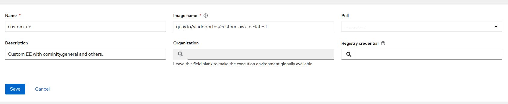

# Create custom EE for AWX

Have some docker registry. I'm going to use https://quay.io but feel free to use any other like Docker Hub, GitLab, etc.

**Clone this repo, and edit:**
- requirements.txt for python requirements
- requirements.yml for Ansible collections

> Note: In docker file we are extending existing official Runtime Environment:
>
> **quay.io/ansible/awx-ee:latest **
>
> https://quay.io/repository/ansible/awx-ee?tag=latest&tab=tags


## Build Docker image locally
I have tagged it with `quay.io/vladoportos/custom-awx-ee:latest ` because thats my account, feel free to use this EE if you like. :smile:

    docker image build --tag quay.io/vladoportos/custom-awx-ee:latest .

```bash
root@automate:~/custom-ee# docker images
REPOSITORY                          TAG       IMAGE ID       CREATED          SIZE
quay.io/vladoportos/custom-awx-ee   latest    8d3b5d412b37   52 minutes ago   1.24GB
.
.
.
```

## Log in to https://quay.io with Docker

```
docker login quay.io
```

## Push the image to quay.io

    docker push quay.io/vladoportos/custom-awx-ee

# Set the new Runtime Environment in AWX

 **Administration -> Execution Environments -> Add**



You can then choose this as Execution Environment in your templates.

# Check for issues in minikube.

Switch to minikube user (this is user I use for minikube server)

    su - minikube
    minikube kubectl get events

You should have something like this when you lunch job:

    11s         Normal    Scheduled       pod/awx-job-170-mhz4t   Successfully assigned default/awx-job-170-mhz4t to minikube
    11s         Normal    Pulling         pod/awx-job-170-mhz4t   Pulling image "quay.io/vladoportos/custom-awx-ee:latest"
    5s          Normal    Pulled          pod/awx-job-170-mhz4t   Successfully pulled image "quay.io/vladoportos/custom-awx-ee:latest" in 5.316071635s
    5s          Normal    Created         pod/awx-job-170-mhz4t   Created container worker
    5s          Normal    Started         pod/awx-job-170-mhz4t   Started container worker

This is sign that it worked most likely. You might get errors like:

    3m18s       Warning   InspectFailed   pod/awx-job-168-x5dlq   Failed to apply default image tag "docker pull quay.io/vladoportos/custom-awx-ee:latest": couldn't parse image reference "docker pull quay.io/vladoportos/custom-awx-ee:latest": invalid reference format
    3m33s       Warning   Failed          pod/awx-job-168-x5dlq   Error: InvalidImageName

This happened when I put wrong name into AWX setting.

## Logout from https://quay.io

```
docker logout quay.io
```
